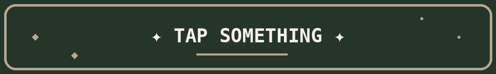
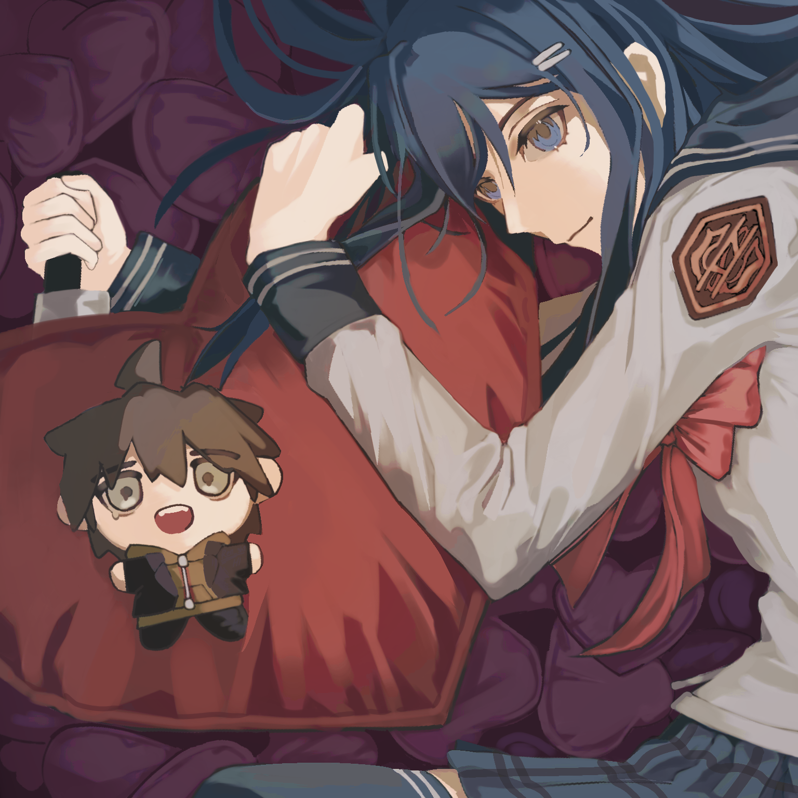

 

 

  

[💻 ATABOOK!](https://rensh.atabook.org)

  

 

---

<table>
<tr>
<td>

INTRODUCTION

 

Hihi! My name is **Ren**, and you can also call me **Shi** or **Ien**.

I'm a pretty low-maintenance person. I also the type who forget things easily, especially when it comes to remembering names...

Even though I surrounded by many people sometimes, I still feel lonely... but let's put that aside. I like being surrounded by people okay, it's just my hearts who feels that way so please don't mind it.

(Sorry that's kinda selfish, lmao)

I rarely talk or show my true feelings to anyone, I'm the type who keeps it to myself. I treat people equally, I'll treat "you" just like how "you" treated me.

I don't mind if people vent to me. It's just that I'm not good at comforting and..that's just kind of awkward, epecially if you demanding me to comfort you...

English, Mandarin, and Arabic, isn't my first nor second language, so there might occasionally be some questionable grammar here.

Don't even question any of it, aight...😭

 

**Aliases:** Shi / Ien

**Type:** Sagittarius · ISTP · 9w1 · 963

</td>
</tr>
</table>

---

<table>
<tr>
<td>

INTERESTS

 

<table>
<tr>

<td align="center">

### 🎮 Gaming

I enjoy lot of games, list on my [Strawpage!](https://rensh1.straw.page)

</td>

<td align="center">

### 📖 Novel

I love reading fanfics // novels.

</td>

<td align="center">

### 🎨 Art

I'm pretty good at this, maybe...

</td>

</tr>
</table>

</td>
</tr>
</table>

---

<table>
<tr>
<td>

FRIENDS

 

<table>
<tr>

<td width="50%">

**1. Yunako**  
[RedNote]()

 

**2. IIra**  
[GitHub](https://github.com/canis-canem-edit)

 

**3. Rei**  
[GitHub](https://github.com/kissofdecay)

</td>

<td width="50%">

**4. Nia**  
[GitHub](https://github.com/nortithacanon)

 

**5. Rudy**  
[GitHub](https://github.com/thendisnigh)

 

**6. Abby**  
[GitHub](https://github.com/abbyyzzz)

</td>

</tr>
</table>

</td>
</tr>
</table>

---

  

<table>
<tr>

<td align="center">

🌐  
[LIT.LINK](https://lit.link/en/rensh1)

</td>

<td align="center">

🎨  
[TWITTER](https://x.com/Ren_sh1)

</td>

<td align="center">

💬  
[STRAWPAGE](https://rensh1.straw.page)

</td>

</tr>
</table>

---

☘ CURRENTLY

 

> probably online... yo, be my friend now!!!

**REN**

`status: Alive`

---

 

### ✦ ARTWORKS ✦

 

<table>
<tr>

<td align="center">

</td>

<td align="center">

</td>

<td align="center">

</td>

</tr>
</table>

 

---

### 👀

**thanks for visiting**

Goodbye.

